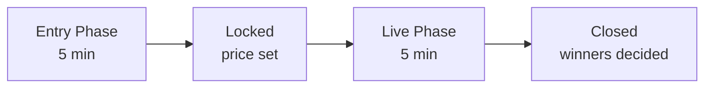

# How To Play SOLPREDS (Devnet)

Devnet is a risk-free testing environment using fake SOL. Perfect for trying out the platform before playing with real funds.

## Wallet Setup

### Step 1: Install a Solana Wallet

We recommend [Phantom Wallet](https://phantom.app):

1. Visit [phantom.app](https://phantom.app)
2. Download browser extension
3. Create new wallet or import existing
4. **Save your seed phrase securely!**

!!! warning "Keep Your Seed Phrase Safe"
    Never share your seed phrase with anyone. SOLPREDS will never ask for it.

### Step 2: Switch to Devnet

1. Open Phantom wallet
2. Click ⚙️ Settings → Developer Settings → Testnet Mode
3. Select **Devnet**

### Step 3: Get Free Devnet SOL

**Option A: Solana Faucet**
1. Visit [faucet.solana.com](https://faucet.solana.com)
2. Paste your wallet address
3. Click "Airdrop 2 SOL"

**Option B: Ask in Community**
Tag [@SOLPREDS_FUN on X](https://x.com/SOLPREDS_FUN) with your address

---

## Placing Bets

### Understanding Rounds

Each round has 3 phases:

**Entry Phase** (5 mins): Place your bet on UP or DOWN

**Lock**: Betting closes, lock price is set

**Live Phase** (5 mins): Price moves, outcome determined

**Settlement**: Winners can claim rewards

### How to Bet

1. **Connect Wallet**
   - Click "Connect Wallet" on [devnet.solpreds.fun/solana](https://devnet.solpreds.fun/solana)
   - Approve connection

2. **Choose Direction**
   - **UP** ↑: You think price will be higher
   - **DOWN** ↓: You think price will be lower

3. **Enter Amount**
   - Minimum: 0.001 SOL
   - Maximum: Varies per round

4. **Confirm Bet**
   - Review payout multiplier
   - Click "Enter UP" or "Enter DOWN"
   - Approve transaction in wallet

!!! tip "Payout Multipliers"
    Payouts are determined by the pool distribution:
    
    - If 70% bet UP, UP payout is ~1.43x
    - If 70% bet DOWN, DOWN payout is ~3.33x
    
    Bet against the crowd for higher multipliers!

---

## Claiming Rewards

### When to Claim

After a round closes and you've won:

1. Go to **"Your Bet History"** section
2. Find winning rounds (green checkmark ✅)
3. Click **"Claim"** button
4. Approve transaction

### What You Get

Fees are applied in two steps: a **2% bet fee** when placing, and a **5% win fee** on your payout.

**Example**:
- You bet: 1 SOL on UP at 2.5x
- After 2% bet fee: 0.98 SOL enters the pool
- Gross payout: 0.98 × 2.5 = 2.45 SOL
- After 5% win fee: **~2.33 SOL** (1.33 SOL profit)

!!! info "Fee Summary"
    Bet fee: 2% (deducted when placing bet)
    
    Win fee: 5% (deducted from winnings)

!!! note "Devnet SOL has no real value"
    All winnings and losses on devnet are simulated. Switch to [mainnet](how-to-play.md) to play with real SOL.

---

## Strategy Tips

### 1. **Check Payout Odds**
Higher payout = riskier bet (fewer people agree with you)

### 2. **Bet Against the Crowd**
If 80% bet UP, consider betting DOWN for 5x multiplier

### 3. **Watch Market Momentum**
Strong trends tend to continue short-term

### 4. **Manage Risk**
Don't bet more than you can afford to lose

### 5. **Time Your Entry**
Bet early to lock in better multipliers

---

## Troubleshooting

??? question "Transaction failed?"
    **Check these:**
    
    - Do you have enough devnet SOL? Get more at [faucet.solana.com](https://faucet.solana.com)
    - Are you on Devnet network in Phantom?
    - Try increasing priority fee in wallet

??? question "Can't see my bet?"
    **Refresh the page** and reconnect wallet
    
    Check transaction on [Solana Explorer (Devnet)](https://explorer.solana.com/?cluster=devnet)

??? question "Claim button disabled?"
    **Round might still be live.** Wait for it to close.
    
    Or you may have already claimed.

---

## Need Help?

- 💬 [Join Discord](https://discord.gg/5EE29Xrc58)
- 🐦 [Follow on X](https://x.com/SOLPREDS_FUN)
- 📱 [Join Telegram](https://t.me/SOLPREDS)