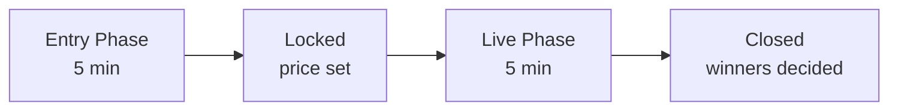

# How To Play SOLPREDS

## Wallet Setup

### Step 1: Install a Solana Wallet

We recommend [Phantom Wallet](https://phantom.app):

1. Visit [phantom.app](https://phantom.app)
2. Download browser extension
3. Create new wallet or import existing
4. **Save your seed phrase securely!**

!!! warning "Keep Your Seed Phrase Safe"
    Never share your seed phrase with anyone. SOLPREDS will never ask for it.

### Step 2: Switch to Devnet

1. Open Phantom wallet
2. Click ⚙️ Settings → Network
3. Select **Devnet**

### Step 3: Get Devnet SOL

**Option A: Solana Faucet**
1. Visit [faucet.solana.com](https://faucet.solana.com)
2. Paste your wallet address
3. Click "Airdrop 2 SOL"

**Option B: Ask in Community**
Tag [@solpreds on X](https://x.com/solpreds) with your address

---

## Placing Bets

### Understanding Rounds

Each round has 3 phases:

**Entry Phase** (5 mins): Place your bet on UP or DOWN

**Lock**: Betting closes, lock price is set

**Live Phase** (5 mins): Price moves, outcome determined

**Settlement**: Winners can claim rewards

### How to Bet

1. **Connect Wallet**
   - Click "Connect Wallet" on [solpreds.fun](https://solpreds.fun)
   - Approve connection

2. **Choose Direction**
   - **UP** ↑: You think price will be higher
   - **DOWN** ↓: You think price will be lower

3. **Enter Amount**
   - Minimum: 0.1 SOL (devnet)
   - No maximum

4. **Confirm Bet**
   - Review payout multiplier
   - Click "Enter UP" or "Enter DOWN"
   - Approve transaction in wallet

!!! tip "Payout Multipliers"
    Payouts are determined by the pool distribution:
    
    - If 70% bet UP, UP payout is ~1.43x
    - If 70% bet DOWN, DOWN payout is ~3.33x
    
    Bet against the crowd for higher multipliers!

---

## Claiming Rewards

### When to Claim

After a round closes and you've won:

1. Go to **"Your Bet History"** section
2. Find winning rounds (green checkmark ✅)
3. Click **"Claim"** button
4. Approve transaction

### What You Get

**Formula**: Your bet × Payout multiplier

**Example**:
- You bet: 1 SOL on UP
- Payout: 2.5x
- You claim: 2.5 SOL (1.5 SOL profit)

!!! success "Fees"
    Bet fee: 2% (deducted when placing bet)
    
    Win fee: 5% (deducted from winnings)

---

## Strategy Tips

### 1. **Check Payout Odds**
Higher payout = riskier bet (fewer people agree with you)

### 2. **Bet Against the Crowd**
If 80% bet UP, consider betting DOWN for 5x multiplier

### 3. **Watch Market Momentum**
Strong trends tend to continue short-term

### 4. **Manage Risk**
Don't bet more than you can afford to lose

### 5. **Time Your Entry**
Bet early to lock in better multipliers

---

## Troubleshooting

??? question "Transaction failed?"
    **Check these:**
    
    - Do you have enough SOL for gas?
    - Are you on Devnet network?
    - Try increasing priority fee in wallet

??? question "Can't see my bet?"
    **Refresh the page** and reconnect wallet
    
    Check transaction on [Solana Explorer](https://explorer.solana.com/?cluster=devnet)

??? question "Claim button disabled?"
    **Round might still be live.** Wait for it to close.
    
    Or you may have already claimed.

---

## Need Help?

- 💬 [Join Discord](https://discord.gg/solpreds)
- 🐦 [DM on Twitter](https://x.com/solpreds)
- 📧 Email: support@solpreds.fun