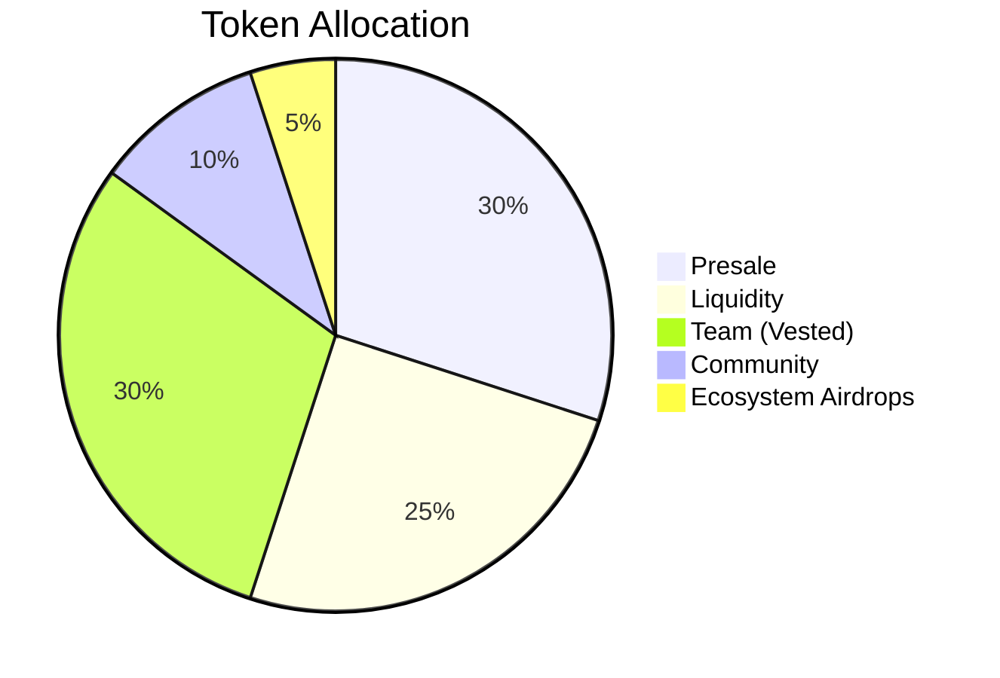

# $SOLPREDS Token Presale

Multi-Chain USDC Contributions • Solana • BNB Chain • Base

!!! warning "Important"
    Must enter a valid Solana address before contributing on BNB Chain or Base to receive $SOLPREDS tokens at TGE. TGE = 1 WEEK AFTER PRESALE END

[Contribute Now →](https://presale.solpreds.fun){ .md-button .md-button--primary }

---

## Token Information

| Detail | Value |
|--------|-------|
| **Token Name** | SOLPREDS |
| **PRESALE START** | FEBRUARY 19TH|
| **Total Supply** | 1,000,000,000 |
| **Presale Allocation** | 30% (300,000,000 tokens) |
| **Liquidity** | 25% (250,000,000 tokens) |
| **Team (Vested)** | 30% (300,000,000 tokens) |
| **Community** | 10% (100,000,000 tokens) |
| **Ecosystem Airdrops** | 5% (50,000,000 tokens) |
| **Presale Price** | Determined by total raised |
| **Listing Price** | TBD (Set after presale ends) |

---

## Token Distribution

---

## Accepted Chains

### Three Chains Supported

Contribute USDC from any of these chains:

=== "⚡ Solana"
    - **Token:** SPL USDC
    - **Network:** Solana Mainnet
    - **Wallet:** Phantom, Solflare

=== "🟡 BNB Chain"
    - **Token:** BEP-20 USDC
    - **Network:** BNB Smart Chain
    - **Wallet:** MetaMask, Trust Wallet

=== "🔵 Base"
    - **Token:** ERC-20 USDC
    - **Network:** Base Mainnet
    - **Wallet:** MetaMask, Coinbase Wallet

---

## How to Participate

### Step-by-Step Guide

1. **Visit** [presale.solpreds.fun](https://presale.solpreds.fun)

2. **Connect Your Wallet**
    - Phantom for Solana
    - MetaMask for BNB Chain/Base

3. **Select Your Preferred Chain**
    - Choose Solana, BNB Chain, or Base

4. **Enter Your Solana Address** (REQUIRED)
    - If contributing from BNB/Base, you MUST enter your Solana address
    - This is where you'll receive your $SOLPREDS tokens at TGE
    - If contributing from Solana, your connected wallet is automatically used

5. **Enter USDC Amount**
    - Minimum: $10 USDC
    - Maximum: $3,000 USDC per wallet

6. **Contribute**
    - Confirm transaction in your wallet
    - Receive confirmation
    - Track your contribution on the presale page

7. **Receive Tokens at TGE**
    - Tokens distributed to your Solana address after presale ends

---

## Contribution Limits

| Limit Type | Amount |
|------------|--------|
| **Minimum Contribution** | $10 USDC |
| **Maximum Per Wallet** | $3,000 USDC |
| **Total Across All Chains** | $3,000 USDC max combined |

!!! info "Cross-Chain Tracking"
    Your contributions are tracked across all three chains. If you contribute $1,000 on BNB and $2,000 on Base, you've reached your $3,000 maximum.

---

## Timeline

| Event | Date |
|-------|------|
| **Presale Start** | TBA |
| **Presale End** | TBA |
| **Token Launch (TGE)** | TBA |
| **Distribution** | At TGE |

---

## Why Multi-Chain?

### Maximum Accessibility

We support three chains to make it easy for everyone to participate:

- ✅ **Solana users** can contribute directly
- ✅ **BNB users** don't need to bridge
- ✅ **Base users** get low gas fees
- ✅ All contributions count toward the same presale total!

### Unified Experience

- Single presale pool across all chains
- Same token price for everyone
- Fair distribution regardless of chain used
- Track your total across all chains in one place

---

## FAQs

??? question "When will I receive my tokens?"
    Tokens will be distributed at TGE (Token Generation Event) to:
    
    - The Solana address you entered (if you used BNB Chain or Base)
    - The Solana address you contributed from (if you used Solana)

??? question "Can I contribute from multiple chains?"
    Yes! You can contribute from all three chains. Your total will be tracked across all chains and distributed to the Solana address you input or have connected.
    
    However, your maximum total across ALL chains is $3,000 USDC.

??? question "What's the minimum contribution?"
    Minimum contribution is $10 USDC on any chain.

??? question "Is there a maximum?"
    Maximum contribution per wallet is $3,000 USDC total across all chains.

??? question "What if I forget to enter my Solana address?"
    You MUST enter a valid Solana address before contributing on BNB Chain or Base. The presale interface will require this before allowing you to contribute.

??? question "Can I change my Solana delivery address?"
    If you contribute from different chains with different Solana addresses, tokens will be sent to each address separately. Make sure to use the same Solana address for all contributions if you want them in one wallet.

??? question "How is the token price determined?"
    The token price is determined by the total amount raised divided by the tokens allocated to presale (300,000,000 tokens = 30% of supply).
    
    Example: If $3,000,000 is raised, price = $3M / 300M tokens = $0.01 per token

??? question "When will tokens be tradeable?"
    Tokens will be tradeable immediately after TGE when liquidity is added to decentralized exchanges (Jupiter/Raydium on Solana).

??? question "Is the team allocation vested?"
    Yes, the 30% team allocation is vested to prevent dumping and ensure long-term commitment to the project.

??? question "What will the listing price be?"
    The listing price will be set after the presale ends based on the total raised and market conditions. It will be announced before TGE.

---

## Security & Trust

- ✅ Multi-chain contribution tracking verified
- ✅ Maximum limits enforced across all chains
- ✅ Transparent token distribution
- ✅ Team tokens vested for long-term alignment
- ✅ 25% allocated to liquidity at launch

---

## Need Help?

- 📧 Email: support@solpreds.fun
- 🐦 Twitter: [@solpreds](https://twitter.com/solpreds)
- 💬 Telegram: [Join our community](https://t.me/solpreds)

---

[Start Contributing Now →](https://presale.solpreds.fun){ .md-button .md-button--primary }
